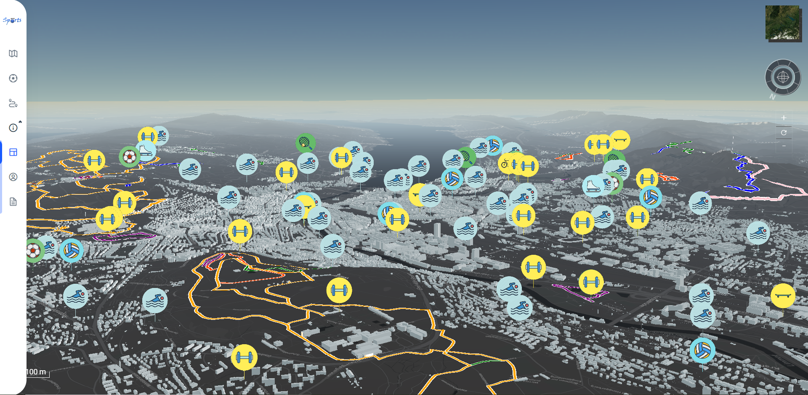

# Sports Zurich

Final Project for ETH Cartography III HS20

<p align="center">
   
</p>

## Introduction

The main purpose of this project is to develop an interesting and attractive 3D web map
to encourage teenagers to go outdoors and help them find sports more easily.

The terrain and building data in the project are provided by [GeoVITe](https://geovite.ethz.ch/),
and the sports data is provided by [stadt Zurich](https://www.stadt-zuerich.ch/geodaten/).

Data status:

- sports facilities: Feb 14, 2019
- sports routes: July 1, 2017

Web app: [http://carto3.ethz.ch/project/qm2NL4tM/](http://carto3.ethz.ch/project/qm2NL4tM/)

More information can be found in the [project report](https://github.com/ywyue/SportsZurich-CartographyIII-Project/blob/master/Cartography_III_report.pdf).
## Project setup

```
npm install
```

### Compiles and hot-reloads for development

```
npm run serve
```

### Compiles and minifies for production

```
npm run build
```

### Lints and fixes files

```
npm run lint
```

### Customize configuration

See [Configuration Reference](https://cli.vuejs.org/config/).
